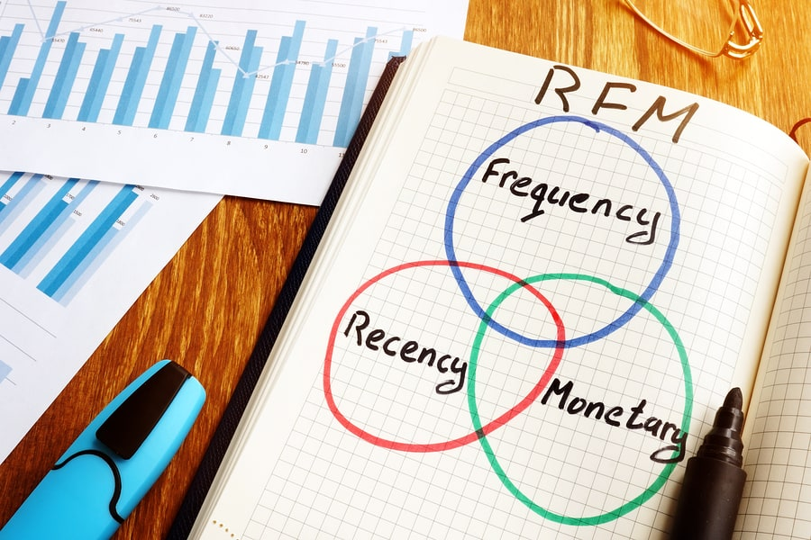
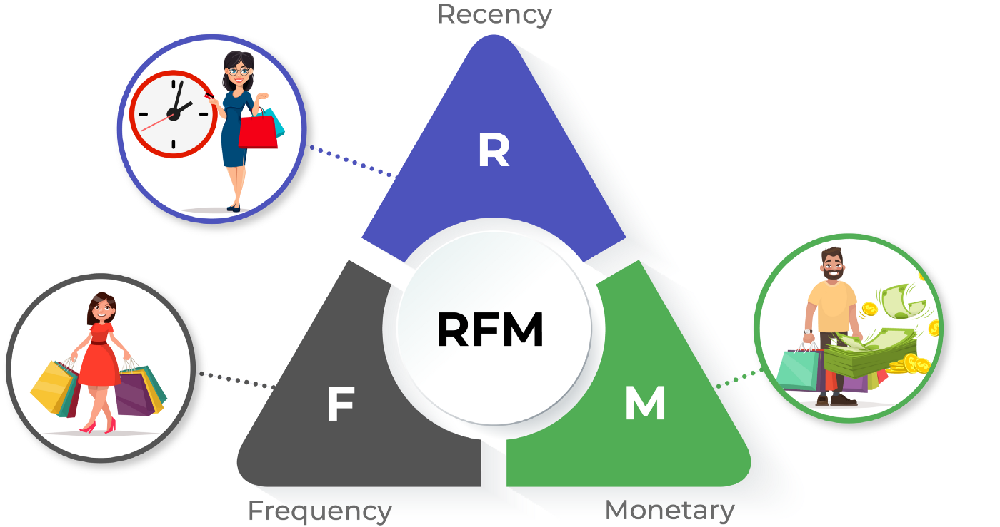
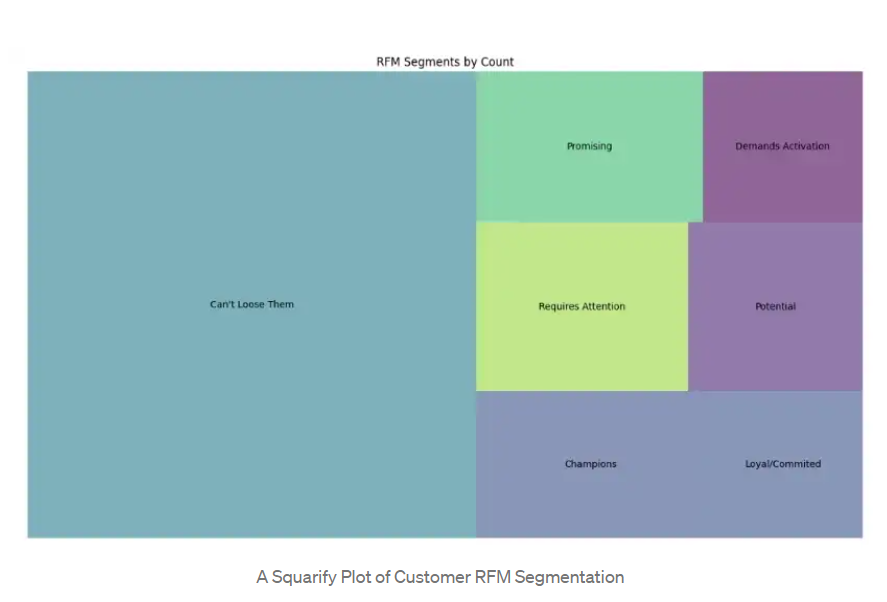

# Customer Segmentation using RFM Analysis

In this project We segmented our customers using RFM Analysis.

RFM stands for Recency,Frequency and Monetary

**Recency**: How much time has elapsed since a customer’s last activity or transaction with the brand? Activity is usually a purchase, although variations are sometimes used, e.g., the last visit to a website or use of a mobile app. In most cases, the more recently a customer has interacted or transacted with a brand, the more likely that customer will be responsive to communications from the brand.

**Frequency**: How often has a customer transacted or interacted with the brand during a particular period of time? Clearly, customers with frequent activities are more engaged, and probably more loyal, than customers who rarely do so. And one-time-only customers are in a class of their own.

**Monetary**: Also referred to as “monetary value,” this factor reflects how much a customer has spent with the brand during a particular period of time. Big spenders should usually be treated differently than customers who spend little. Looking at monetary divided by frequency indicates the average purchase amount – an important secondary factor to consider when segmenting customers.

**_Segmentationn Levels_**:

- **Champion Customer:** bought recently, buy often and spends the most
- **Loyal/Committed:** spend good money and often, responsive to promotions
- **Potential:** recent customers, but spent a good amount and bought more than once
- **Promising:** recent shoppers, but haven’t spent much
- **Requires Attention:** above average recency, frequency, and monetary values; may not have bought very recently though
- **Demands Activation:** below average recency, frequency, and monetary values; will lose them if not reactivated
- **Can’t Lose them:** made biggest purchases, and often but haven’t returned for a long time

#### Linkedin  : https://www.linkedin.com/in/harshalkakaiya/

#### Medium    : https://medium.com/@harshal.61/

#### Website   : https://harshalk.netlify.app/
